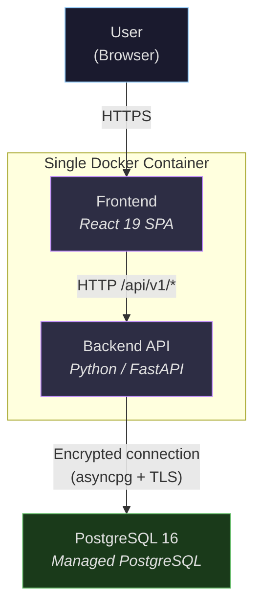
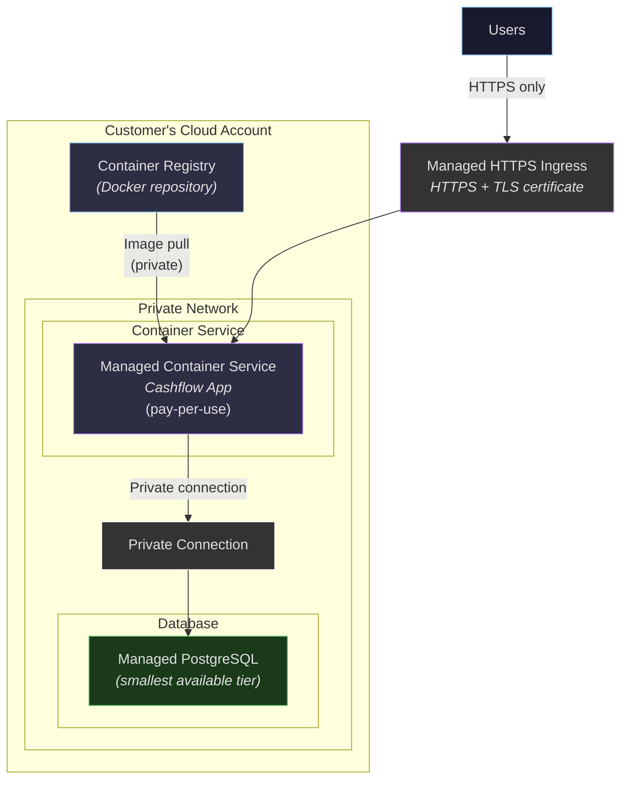
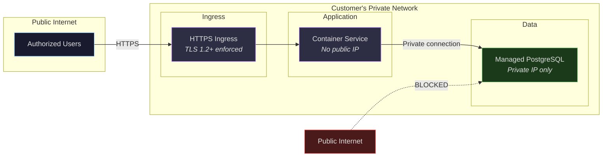
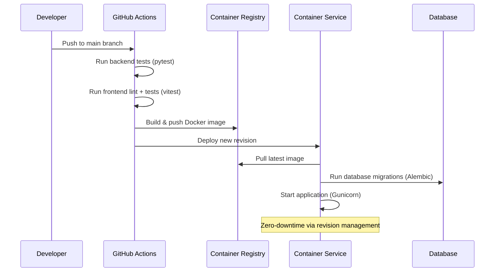

# Cashflow App — Architecture & Hosting Overview

## 1. Application Overview

The Cashflow App is a **12-month rolling cash flow projection tool** for property development projects. It replaces complex Excel-based workflows with a purpose-built web application that provides:

- **Automated data import** from existing Excel workbooks
- **Manual data entry** with real-time recalculation across all dependent metrics
- **Phase-by-phase comparison** (budget vs current) across up to 5 project phases
- **Profit & Loss summaries** derived from live project data

The application follows a **single-tenant deployment model** — each customer receives their own dedicated instance running entirely within their own cloud environment.

---

## 2. Application Architecture

The application is a modern three-tier web application packaged as a single Docker container for production deployment.

| Layer | Technology | Purpose |
|-------|-----------|---------|
| **Frontend** | React 19, Vite 7 | Interactive SPA with 5 tab views (Dashboard, Forecast, Phase Comparison, P&L, Data Entry) |
| **Backend** | Python 3.11, FastAPI | RESTful API with async request handling, Excel parsing, cascade recalculation engine |
| **Database** | PostgreSQL 16 (managed service) | All application data — imports, financial projections, phase inputs, comparisons |
| **Production Server** | Gunicorn + Uvicorn | ASGI server with auto-scaling workers (`CPU × 2 + 1`) |

**Production build**: A multi-stage Docker build compiles the React frontend into static files, then bundles them with the Python backend into a single lightweight image. The backend serves both the API and the frontend assets — no separate web server required.

**Security by default**: The production container runs as a non-root user (`appuser`).

---

## 3. Cloud Hosting Architecture

The application is deployed to a **managed container service** with a **managed PostgreSQL** database, all within the customer's own cloud account.

| Component | Role |
|-----------|------|
| **Managed container service** | Runs the application container with auto-scaling and pay-per-use billing |
| **Managed PostgreSQL** | Database with automated backups, private networking, no public IP |
| **Container registry** | Stores the application Docker image in the customer's account |
| **Private networking** | Network isolation — database is only reachable from the container service |
| **Managed HTTPS ingress** | TLS termination with auto-provisioned certificates |

> For specific service names, configuration, and cost estimates per cloud provider, see the [Cloud Provider Appendices](cloud-providers/README.md).

---

## 4. Data Residency & Sovereignty

This is the core security guarantee: **all customer data remains within the customer's own cloud account at all times.**

### Where data is stored

- **All application data** (financial projections, import history, phase inputs) is stored in the **managed PostgreSQL** instance inside the customer's cloud account
- The database is deployed in the **customer's chosen cloud region** (e.g., Sydney, London, Virginia)
- **Uploaded Excel files** are processed in-memory and discarded — only the extracted data is persisted to the database

### What stays inside the customer's cloud

| Component | Location | Owned by |
|-----------|----------|----------|
| Application container | Customer's container service | Customer |
| Database | Customer's managed PostgreSQL | Customer |
| Container images | Customer's container registry | Customer |
| Network infrastructure | Customer's virtual private network | Customer |
| TLS certificates | Customer's ingress / load balancer | Customer |
| Backups | Customer's cloud region (configurable) | Customer |

### What the application does NOT do

- **No external API calls** — the application makes zero outbound calls to third-party services
- **No telemetry or analytics** — no data is sent to any external monitoring or tracking service
- **No vendor-hosted components** — there is no SaaS dependency; everything runs in the customer's cloud
- **No shared infrastructure** — single-tenant means no shared databases, no shared compute, no multi-tenant data mixing

### Customer control

- The customer has **full IAM control** over all resources via their cloud provider's identity and access management
- The customer can **audit all network traffic** via their cloud provider's network flow logs
- The customer can **delete all data and resources** at any time — there is no external dependency
- **No vendor lock-in** on data — PostgreSQL is an open standard; data can be exported via standard tools (`pg_dump`)

---

## 5. Access Control & Network Isolation

### Network Security

- **Database has no public IP** — accessible only via private connection within the virtual network
- **Container service** is VPC-connected — database traffic stays within the provider's private network
- **TLS 1.2+** enforced on all external connections via managed HTTPS ingress
- **Firewall rules** restrict traffic to only required ports and protocols

### Infrastructure Access Control

- **Provider IAM** controls who can manage the infrastructure (deploy, configure, access logs)
- **Audit logs** record all management-plane operations
- **Cloud logging** aggregates application and infrastructure logs for monitoring and audit

### Authentication & SSO

The application is designed to integrate with the customer's **existing corporate identity provider** via standard protocols (OIDC / SAML 2.0). This means users sign in with their existing corporate credentials — no separate passwords to manage.

All three major cloud providers offer **proxy-level authentication** that sits in front of the application and verifies identity before any request reaches the app. This requires **zero application code changes**:

| Provider | Proxy-Level Auth | What It Does |
|----------|-----------------|--------------|
| Google Cloud | Identity-Aware Proxy (IAP) | Authenticates users via Google or federated IdP before forwarding requests |
| AWS | ALB + OIDC / Verified Access | ALB authenticates via any OIDC provider; Verified Access adds device posture checks |
| Azure | Easy Auth | Built-in Container Apps auth layer using Entra ID (Azure AD) |

For fine-grained control (app-level roles, audit logging by user), the FastAPI backend can also validate JWTs directly from any OIDC provider.

> For detailed SSO options per provider, see the [Cloud Provider Appendices](cloud-providers/README.md).

### Private Access (No Public Exposure)

For customers who require that the application is **not accessible from the public internet**, every major cloud provider offers options to restrict access to the corporate network only:

| Approach | How It Works | VPN Required? |
|----------|-------------|---------------|
| **Identity-aware proxy** | Public URL, but only authenticated corporate users can access. Unauthenticated requests are rejected at the proxy layer. | No |
| **Internal-only ingress + VPN** | The application URL is only reachable from within the virtual private network. Users connect via corporate VPN or dedicated link. | Yes |
| **Private endpoint / PrivateLink** | The application is exposed as a private endpoint within the customer's network. Only reachable from peered networks. | Yes |

The identity-aware proxy approach (IAP, ALB+OIDC, Easy Auth) is recommended for most deployments — it provides strong access control without requiring VPN infrastructure.

> For provider-specific private access options, see the [Cloud Provider Appendices](cloud-providers/README.md).

---

## 6. Deployment Process

### How the application is deployed

1. **Code changes** are pushed to the `main` branch on GitHub
2. **CI pipeline** automatically runs all backend and frontend tests
3. On success, the **production Docker image** is built and pushed to the customer's container registry
4. The **container service** creates a new deployment revision with the updated image
5. On container startup, **database migrations run automatically** (Alembic), ensuring the schema is always up to date
6. **Traffic shifts** to the new revision — the previous revision remains available for instant rollback

### Update guarantees

- **Zero-downtime deployments** via container service revision management
- **Automatic rollback** if the new revision fails health checks
- **All tests must pass** before any deployment proceeds
- **Database migrations are forward-compatible** — no breaking schema changes

---

## 7. Estimated Cloud Hosting Costs

A single-tenant deployment with low traffic (~1,000 requests/day) typically costs **$15–40 USD/month** depending on the cloud provider, region, and chosen service tiers.

| Cost Category | What It Covers |
|---------------|---------------|
| **Container compute** | Running the application (pay-per-use or reserved capacity) |
| **Managed database** | PostgreSQL instance with automated backups |
| **Container registry** | Storing Docker images |
| **Networking** | Private networking, TLS, ingress — often included at no extra cost |

All three major providers offer pay-per-use container hosting with generous free tiers, keeping costs low for single-tenant deployments.

> For detailed cost breakdowns by provider, see the [Cloud Provider Appendices](cloud-providers/README.md).

---

## 8. Security Roadmap

The following enhancements are planned to further strengthen the application's security posture:

| Enhancement | Description | Status |
|------------|-------------|--------|
| **User Authentication** | Integration with the customer's corporate identity provider via OIDC/SAML federation — users authenticate with their existing credentials | Planned |
| **Secrets Management** | Move database credentials and application secrets from environment variables to the cloud provider's secrets management service | Planned |
| **Audit Logging** | Record all data modifications (who changed what, when) with tamper-resistant audit trail | Planned |
| **Rate Limiting** | API-level rate limiting to prevent abuse and ensure fair usage | Planned |

These enhancements build on the existing strong foundation of network isolation and data sovereignty. The current deployment model — where the application runs entirely within the customer's cloud account with no public database access — already provides a robust security boundary.
